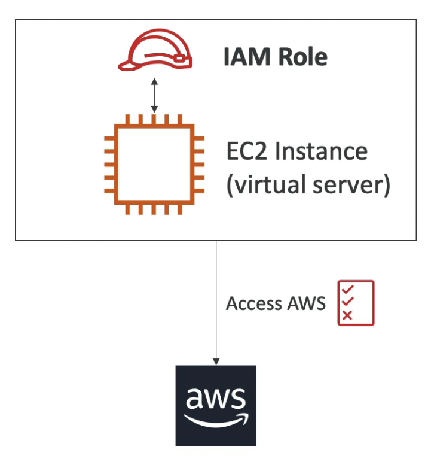

# IAM: Users & Groups

### 1. IAM:

- IAM = Identity and Access Manangement, global service
- root account created by default, shouldn't be used or shared
- Users are people within your organizationm, and can be grouped
- Groups only contain users, not other groups
- Users don't have to belong to a group, and user can belong to multiple group

## IAM: Permissions

- Users or Groups can be assigned JSON documents called policies

```JSON
 {
    "Version": "2012-10-17",
    "Statement": [
        {
            "Effect": "Allow",
            "Action": "ec2: Describe*",
            "Resource": "*"
        },
        {
            "Effect": "Allow",
            "Action": "elasticloadbalancing:Describe*",
            "Resource": "*"
        },
        {
            "Effect": "Allow",
            "Action": [
                "cloudwatch:ListMetrics",
                "cloudwatch:GetMetricStatistics",
                "cloudwatch:Describe*"
            ],
            "Resource": "*"
        }
    ]
 }
```

- These policies define the permissions of the users
- In AWS you apply the least privilege principle: don't give more permissions then a user needs

---

## IAM: Personal Note for IAM

- Access User Type:

  1. Access key: Enalbes an access key ID and secret access key for the AWS API, CLI, SDK, and other development tools

  2. password: Enables a password that allows users to sign-in to the AWS management console
     d

- Policies inheritance

  1. Inline policy can be created for who is not included the group user

- Policies Structure

  ```JSON
  {
    "Version":"2012-10-17", // 1.
    "Id": "S3-Account-Permissions", // 2.
    "Statement":[{ // 3.
        "Sid":"1",
        "Effect":"Allow",
        "Principal":{
            "AWS":["arn:aws:iam::123456789012:root"]
        },
        "Action":[
            "s3:GetObject",
            "s3:PutObject",
        ],
        "Resource":["arn:aws:s3:::mybucket*"]
    }]
  }
  ```

- 1. Version: policy language version, always include"2012-10-17"
- 2. Id: an identifer for the policy(optional)
- 3. Statement: one or more individual statements(required)
     - Sid: an identifer for the statement(optional)
     - Effect: whether the statement allows or denies access(Allow or Deny)
     - Principal: account/user/role to which this policy applied to
     - Action: list of actions this policy allows or denies
     - Resource: list of resources to which the actions applied to
     - Condition: conditions for when this policy is in effect(optional)

- Multi Factor Authentication( MFA )

  1. Users have access to your account and can possibly change configurations or delete resources in your aws account
  2. You want to protect your Root Accounts and Iam users,
     use MFA(password + security device you own)
  3. Choose the type of MFA device to assign:
     - Virtual MFA device
     - U2F security key
     - other hardware MFA device

- How can users access AWS

  1. To access AWS, you have three options:

     1. AWs Management Console(protectd by password + MFA)

     2. AWs command line interface(CLI): protected by access keys

     3. awss software Developer kit(SDK) - for code: protect by access keys

  2. Access Keys are generated through the AWS console

  3. Users manage their own access keys

  4. Access Keys are secret, just like a password. Dont't share them

  5. Access key ID = username

  6. Secret Access Key = password

- What's the AWS CLI

  1. A tool that enalbes you to interact with AWS services using commands in your command-line shell

  2. It can be direct access to the public APIs of AWS services

  3. command:
     - aws configure : setup user and region
     - aws iam list-users : show users
     - echo "test" > demo.txt (create txt file)

- what's the AWS SDK

  1. AWs software development kit
  2. Embedded within your app

- IAM Roles for Services

  1. Some AWS Service will need to perform actions on your behalf

  2. To do so, we will assign permissions to AWS services with IAM Roles, this mean is if EC2 wanna do some actions, EC2 needs permissions
     

     - common roles:
       1. EC2 Instance Roles
       2. Lambda Function Roles
       3. Roles for CloudFormation
