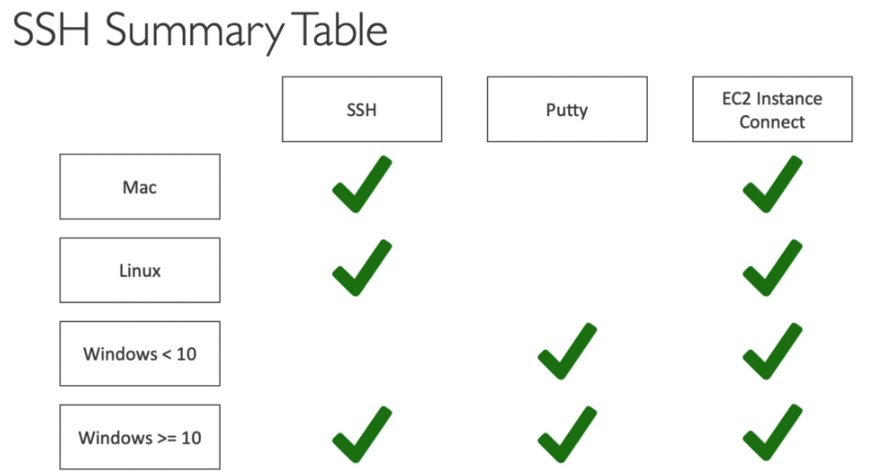
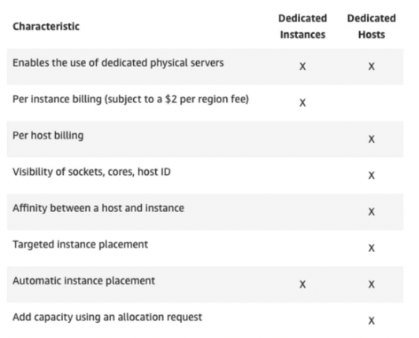
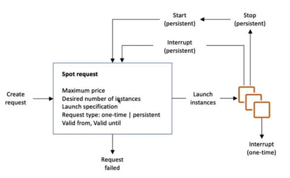

# AMAZON EC2

## Before Starting

### 1. EC2 is one of the most popular of AWS' offering

### 2. EC2 = Elastic Compute Cloud = Infrastructure as a Service

### 3. It mainly consists in the capability of :

    - Renting Virtual Machines(EC2)
    - Storing data on virtual drives (EBS)
    - Distribuiting load acroess machines (ELB)
    - Scaling the services using an auto-scaling group(ASG)

### 4. Knwoing EC2 is fundamental to understand how the Cloud works

# Basic Step for EC2 introduction

## 1. EC2 Sizing & configuration options

    - Operating System (OS): Linux, Windows or MacOS
    - How much compute power & cores (CPU)
    - How much random-access memory(RAM)
    - How much storage space:
        - Network-attched(EBS &EFS)
        - hardware (EC2 instance store)
    - Network card: speed of the card, Public IP address
    - Firewall rules: security group
    - Bootstrap script (configure at first launch) : EC2 User Data

## 2. EC2 User Data

    1. It is possible to bootstrap our instances using an EC2 User data script
    2. bootstrapping means **launching commands when a machine starts**
    3. That script is only run once at the instance first starting
    4. EC2 user data is used to automate boot tasks such as:
        1. installing updates
        2. installing software
        3. downloading common files from the internet
        4. anything you can think of

    5. The EC2 User data script runs with the root user (sudo command)

## 3. while setting EC2 instance

1. there is User Data section that is script section before starting instance

```javascript
#!/bin/bash
# Use this for your user data (script from top to bottom)
# install httpd (Linux 2 version)
yum update -y
yum install -y httpd
systemctl start httpd
systemctl enable httpd
echo "<h1>Hello World from $(hostname -f)</h1>" > /var/www/html/index.html
```

if you put it in there, the instacne will excute this script after starting the machine

## 4. AWS Naming Convention

    **m5.2xlarge**

    1. m : instance class
    2. 5 : generation (AWS improves them over time)
    3. 2xlarge : size within the instance class (big = big cpu big ram etc..)

## 5. General Purpose of EC2 Instance

    1. Great for a diversity of workloads such as web servers or code repositories
    2. Good balance between :
        - Compute
        - Memory
        - Networking

    3. In the course, we will be using the t2.micro which is a general purpose EC2 instance

## 6. Compute Optimized(High performance Instance)

    1. Great for compute-intensive tasks that require high performance processors:
        - Bastch processing workloads
        - Media transcoding
        - High performance web servers
        - High perfermance computing(HPC)
        - Scientific modeling & machine learning
        - Dedicated gaming servers
        - name starts by *C*, example: C6g, C5, C5a etc..

## 7. Memory Optimized

    1. Fast performance for workloads that process large data sets in memory
    2. Use cases:
        - High performance, r/non db
        - Distributed web scale cache stores
        - in-memory db optimized for BI
        - Applications performing real-time processing of big unstructure data

## 8. Storage Optimized

    1. Great for storage-intensive tasks that requrie high,sequential read and write access to large data sets on local storage
    2. Use case:
        - High frequency online transaction processing systems
        - Realational & NoSQL db
        - cache for in-memory db(redis)
        - Data warehosing app
        - distributed file systems

    3. name starts with I3, D2, D3 etc..

## check this out webiste

https://instances.vantage.sh/

---

# Introduction to Security Groups

- security groups are the fundamental of network security in aws
- they control how traffic is allowed into or out of our ec2 instances
- security groups only contain allow rules
- security groups rules can reference by IP or by security group


## 1. Security Groups Deeper Dive

     - Security groups are acting as a "firewall" on EC2 instances
     - They regulate:
        - Access to ports
        - authorised IP ranges - IPv4 and IPv6
        - Control of inbound network(from other to the instance)
        - Control of outbound network(from the instance to other)


if the port is not allowed some traffic, they will response timeout error

- outbound traffic is noramlly allowed all traffic


## 3. Security groups Good to know

- Can be attached to multiple instances
- Locked down to a region / VPC combination
  (so if you change regions, must create new vpc)

- Does live 'outside' the ec2 - if traffic is blocked the ec2 instance won't see it

- it's good to maintain one separate security groups for ssh access

- If your application is not accessible(time out), then it's a security group issue\*

- If your app gives a "connection refused" error, then it's an app error or it's not launched

- All inbound traffic is blocked by default

- All outbound traffic is authroised by default

## 4. Classic Ports to know

1. SSH(22): Secure Shell - log into a linux instance

2. FTP(21): File Transfer Protocol - upload files into a file share

3. SFTP(22): Secure File Transfer Protocol - upload files using SSH

4. HTTP(80): access unsecured websites

5. HTTPS(443): access secured websites

6. RDP(3389): Remote Desktop Protocol - log into a windows instance

## 5. SSH Summary Table

1. SSH can be only used MAC / Linux / window > 10



## 6. How to Access EC2 with SSH

1. one of the famous error: 
    Permissions 0644 for 'key.pem' are too open.
    solutions: chmod 0400 key.pem
    set lower authorization

2. ssh -i key.pem ec2-user@publicIP


## 7. EC2 Instances Purchasing options (*)

1. On-Demand Instances: short workload, predictable pricing
2. Reserved: (at least an year)
    - Reserverd Instances: long workloads
    - Convertible Reserved Instances: long workloads with flexible instances
    - Scheduled Reserved Instances: ex) every Thurday between 3 and 6pm
      * Note: Scheduled Reserved Instances are deprecated, but might still come up in the exam
    - Spot Instances: short workloads, cheap, can lose instances (less reliable)
    - Dedicated Hosts: book an entire physical server, control instance placement
  

## 8. EC2 On Demand
1. Pay for what you use: 
   - Linux or widnows - billing per second, after the first minute
   - All other operating systems - billing per hour
2. Has the highest cost but no upfront payment
3. No long-term commitment
4. Recommended for short-term and un-interrupted workloads, where you can't predict how the application will behave


## 9. EC2 Reserved Instances

1.  Up to 75% discount compared to On-demand
2.  Reservation period: 1year ~ 3years, more years, more discount
3.  Purchasing options: 
 no upfront, partial upfront = small discount
 all upfront = big discount
4. Reserve a *specific instance* type
5. Recommended for steady-state usage applications(think db)

6. Convertible Reserved Instance
    - can change the EC2 instance type
    - Up to 54$ discount

7. Scheduled Reserved Instance
    - launch within time window you reserve
    - when you require a fraction of day / week / month
    - Still commitment over i to 3 years


## 10. EC2 Spot Instances
1. Can get a discount of up to 90% compared to On-demand
2. Instnaces that you can 'lose' at any point of time if your max price is less then the current spot price
3. The MOST cost-efficient instances in AWS
4. Useful for workloads that are resilient to failure
   1. Batch jobs
   2. Data analysis
   3. Image processing
   4. Any distributed workloads
   5. workloads with a flexible start and end time

5. Not suitable for critical jobs or databases
   

## 11. EC2 Dedicated Hosts
  - An Amazon EC2 Dedicated Host is physical server with EC2 instance capacity fully dedicated to your use.
  - Dedicated Hosts can help you address compliance requirements and reduce costs by allowing you to use your existing server-bound software licenses.
  - Allowcated for your account for a 3-year period reservation
  - More expensive
  - Useful for software that have complicated licensing model
  - Or for companies that have strong regulatory or compliance needs 

## 12. EC2 Dedicated Instances
  - Instances running on hardware that's dedicated to you
  - May share hardware with other instances in same account
  - No control over instance placement(can move hardware after Stop / Start)



[Summary]

what if i have choose a resort to stay, Which purchasing option is right for me?

1. On-demand: comming and staying in resort whenever we like, we pay the full price
2. Reserved: like planning ahead and if we plan to stay for a long time, we may get a good discount
3. Spot Instnaces: the hotel allows people to bid for the empty rooms and the highest bidder keeps the room. you can get kicked out at any time if who pay more money then what i paid
4. Dedicated Hosts: We book an entire building of the resort 


## 13. EC2 Spot Instances Requests

1. Can get a discount of up to 90% compared to On-demand
2. Define max spot price and get the instnace while current spot price < max
   1. The hourly spot price varies based on offer and capacity
   2. if the current spot price > your max price you can choose to stop or terminate your instance with a 2mintues grace period

3. Other strategy: Spot block
   1. "block" spot instance during a specified time frame(1 to 6 hours) without interruptions
   2. In rare situations, the instance may be reclaimed
4. used for batch jobs, data analysis, or worklads that are resilient to failures
5. Not great for critical jobs or databases
   
## 14. How to terminate Spot Instances? (*)
   - 
   - You can only cancel Spot instance requrests that are open, active, or disabled  
   - Cancelling a Spot Request does not terminate instances
   - You must first cancel a Spot Request and then terminate the associated Spot Instances

## 15. Spot Fleets(집합) (*)
1. Spot Fleets: set of Spot Instances + (optional) on-demand Instances
2. The Spot Fleet will try to meet the target capacity with price constraints
   1. define possible launch pools: instnace type (m5.large) , OS, Availability Zone
   2. can have multiple launch pools, so that the fleet can choose
   3. Spot Fleet stops launching  instnaces when reaching capacity or max cost

3. Stragegies to allocate Spot Instance:
   1. LowestPrice: from the pool with the lowest price(cost optimization, short workloads)
   2. diversified: distributed across all pools(great for availability, long workloads)
   3. capacityOptimized: pool with the optimal capacity for the number of instances

=> Spot Fleets allow us to automatically request Spot Instnaces with the lowest price