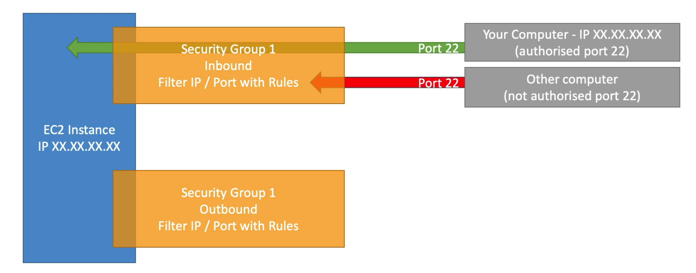
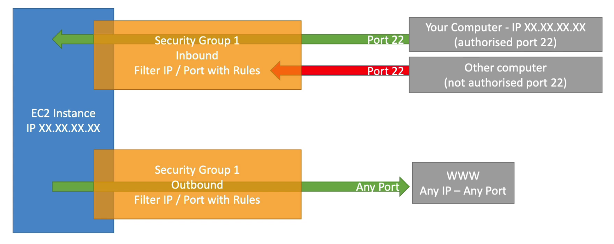

# AMAZON EC2

## Before Starting

### 1. EC2 is one of the most popular of AWS' offering

### 2. EC2 = Elastic Compute Cloud = Infrastructure as a Service

### 3. It mainly consists in the capability of :

    - Renting Virtual Machines(EC2)
    - Storing data on virtual drives (EBS)
    - Distribuiting load acroess machines (ELB)
    - Scaling the services using an auto-scaling group(ASG)

### 4. Knwoing EC2 is fundamental to understand how the Cloud works

# Basic Step for EC2 introduction

## 1. EC2 Sizing & configuration options

    - Operating System (OS): Linux, Windows or MacOS
    - How much compute power & cores (CPU)
    - How much random-access memory(RAM)
    - How much storage space:
        - Network-attched(EBS &EFS)
        - hardware (EC2 instance store)
    - Network card: speed of the card, Public IP address
    - Firewall rules: security group
    - Bootstrap script (configure at first launch) : EC2 User Data

## 2. EC2 User Data

    1. It is possible to bootstrap our instances using an EC2 User data script
    2. bootstrapping means **launching commands when a machine starts**
    3. That script is only run once at the instance first starting
    4. EC2 user data is used to automate boot tasks such as:
        1. installing updates
        2. installing software
        3. downloading common files from the internet
        4. anything you can think of

    5. The EC2 User data script runs with the root user (sudo command)

## 3. while setting EC2 instance

1. there is User Data section that is script section before starting instance

```javascript
#!/bin/bash
# Use this for your user data (script from top to bottom)
# install httpd (Linux 2 version)
yum update -y
yum install -y httpd
systemctl start httpd
systemctl enable httpd
echo "<h1>Hello World from $(hostname -f)</h1>" > /var/www/html/index.html
```

if you put it in there, the instacne will excute this script after starting the machine

## 4. AWS Naming Convention

    **m5.2xlarge**

    1. m : instance class
    2. 5 : generation (AWS improves them over time)
    3. 2xlarge : size within the instance class (big = big cpu big ram etc..)

## 5. General Purpose of EC2 Instance

    1. Great for a diversity of workloads such as web servers or code repositories
    2. Good balance between :
        - Compute
        - Memory
        - Networking

    3. In the course, we will be using the t2.micro which is a general purpose EC2 instance

## 6. Compute Optimized(High performance Instance)

    1. Great for compute-intensive tasks that require high performance processors:
        - Bastch processing workloads
        - Media transcoding
        - High performance web servers
        - High perfermance computing(HPC)
        - Scientific modeling & machine learning
        - Dedicated gaming servers
        - name starts by *C*, example: C6g, C5, C5a etc..

## 7. Memory Optimized

    1. Fast performance for workloads that process large data sets in memory
    2. Use cases:
        - High performance, r/non db
        - Distributed web scale cache stores
        - in-memory db optimized for BI
        - Applications performing real-time processing of big unstructure data

## 8. Storage Optimized

    1. Great for storage-intensive tasks that requrie high,sequential read and write access to large data sets on local storage
    2. Use case:
        - High frequency online transaction processing systems
        - Realational & NoSQL db
        - cache for in-memory db(redis)
        - Data warehosing app
        - distributed file systems

    3. name starts with I3, D2, D3 etc..

## check this out webiste

https://instances.vantage.sh/

---

# Introduction to Security Groups

- security groups are the fundamental of network security in aws
- they control how traffic is allowed into or out of our ec2 instances
- security groups only contain allow rules
- security groups rules can reference by IP or by security group


## 1. Security Groups Deeper Dive

     - Security groups are acting as a "firewall" on EC2 instances
     - They regulate:
        - Access to ports
        - authorised IP ranges - IPv4 and IPv6
        - Control of inbound network(from other to the instance)
        - Control of outbound network(from the instance to other)

## 2. Security Groups Diagram


if the port is not allowed some traffic, they will response timeout error

- outbound traffic is noramlly allowed all traffic


