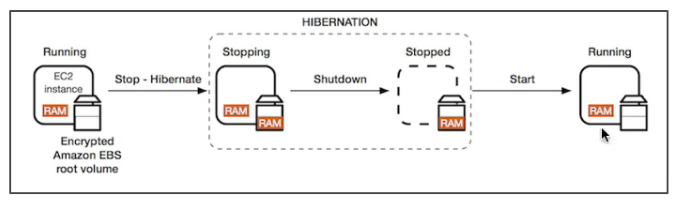

# IP

## 1. Private vs Public

- IPv4 : 1.160.10.240
- IPv6 : 1900:4545:3:200:f8ff:fe21:67cf
- IPv4 is still the most common format used online
- IPv6 is newer and solves problems for the internet of things

### Fundamental Differences

1. Public IP:

   - Public IP means the machine can be identified on the internet (WWW)
   - Must be unique across the whole web (not two machines can have the same public IP address)
   - Can be geo-located easily

2. Pirvate IP:

   - Private IP means the machine can only be identified on a private network only
   - The IP must be unique across the private network
   - BUT two different private networks (two companies) can have the same IPs
   - Machinee connect to WWW using a NAT + internet gateway (a proxy)

3. Elastic IP:

## Placement Groups

- Sometimes you want control over the EC2 Instance placement strategy
- That strategy can be defined using placement groups
- When you create a placement group, you specify one of the folowwing strategies for the group:
  1. Cluster - clusters instances into a low-latency group in a single availability zone
  2. Spread - spreads instances across underlying hardware (max 7instances per group per AZ) - critical aplications
  3. Partition - spreads instances across many different partitions(which rely on diffrent sets of racks) within an AZ. scales to 100s of EC2 instances per group(Hadoop, Cassandra, Kafka)

## Elastic Network Interfaces (ENI)

- Logical component in a VPC that represents a virtual network card
- The ENI can have the following attributes:
  1. Primary private IPv4, one or more secondary IPv4
  2. One Elastic IP(IPv4), one or more private IPv4
  3. One Public IPv4
  4. One or more security groups
  5. A MAC address
- You can create ENI independently and attach them on the fly (move them) on EC2 instances for failover
- Bound to a specific AZ
- ENI needs to access to network

## EC2 Hibernate

- We know we can stop, terminate instances

  1. Stop: the data on disk(EBS) is kept intact in the next start
  2. Terminate: any EBS volumes (root) also set-up to be destroyed is lost

- On start, the following happends:
  1. First start: the OS boots & the EC2 User Data script is run
  2. Following starts: the OS boots up
  3. Then your application starts, caches get warmed up, and that can take time!

### THEREFORE, EC2 Hibernate(잠자기모드):

    1. The in-memory (RAM) state is preserved
    2. The instance boot is much faster(OS is not stopped or restart)
    3. Under the hood: the RAM state is written to a file in the root EBS volume
    4. The root EBS volume must be encrypted

#### Use cases:

    1. long-running processing
    2. saving the RAM state
    3. services that take time to initialize
    4. Supported instance families: C3,4,5, M3,4,5, R3,4 and R5
    5. instnace RAM size - must be less then 150GB
    6. AMI : amazon linux , ubuntu , window
    7. Available for on-demand and Reserved instances
    8. An instance cannot be hibernated more then 60days
