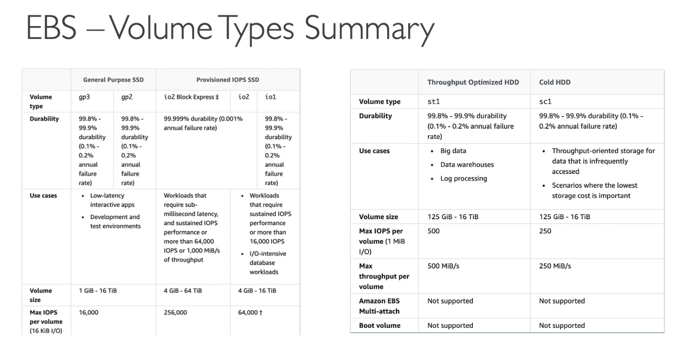

# EC@ instance storage section

## 1. EBS

- An EBS(Elastic Block Store) Volume is a network drvie you can attach to your instances while they run
- It allows your instances to persist data, even after their termination
- network USB stick
- Free tier: 30GB of free EBS storage of type general purpose SSD or Magnetic per month
- It's a network drvie (Not a physical drive)

  - it uses the network to communicate the instance, which means there might be a bit of latency
  - it can be detached from an EC2 instance and attached to another one quickly

- It's locked to an AZ
  - An EBS Volumn in us-east-1a cant be attached to us-east-1b
  - To move a volume across, you first need to snapshot it
- Have a provisioned capacity (size in GBs, and IOPS)

## 2. Provisioned IOPS (PIOPS) SSD

- Critical business applications with sustained IOPS performance
- Or applications that need more then 16,000 IOPS
- Great for databases workloads (sensitive to storage perf and consistancy)
- io1 / io2 (4GiB - 16TiB)
  - Max PIOPS:64,000 for Nitro EC2

## SUMMARY

