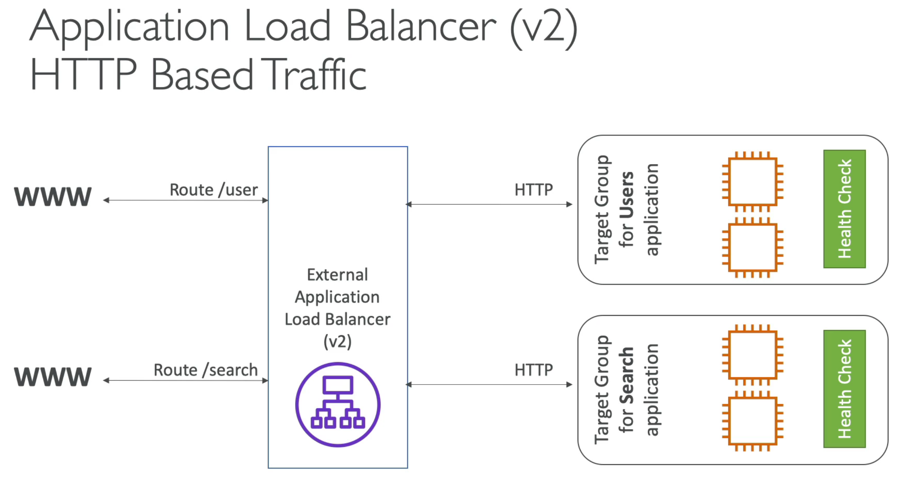
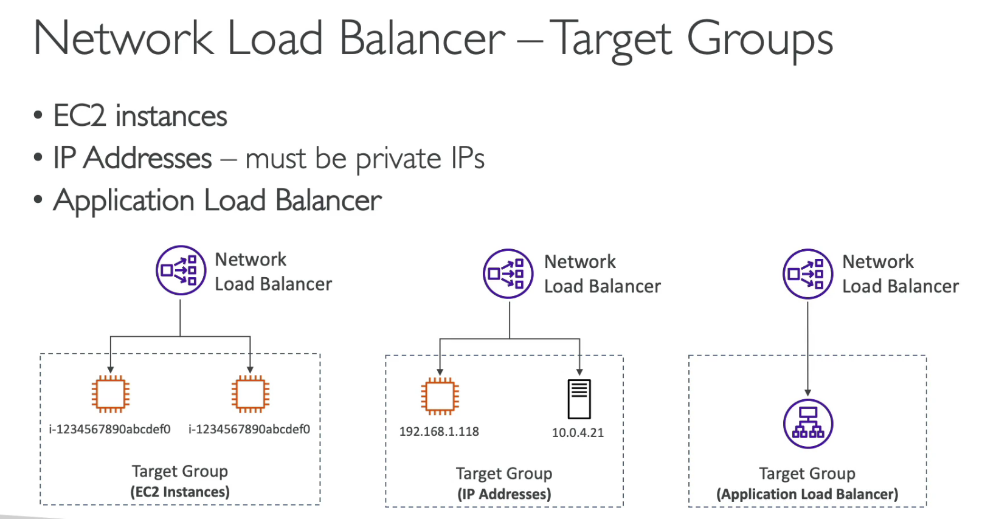
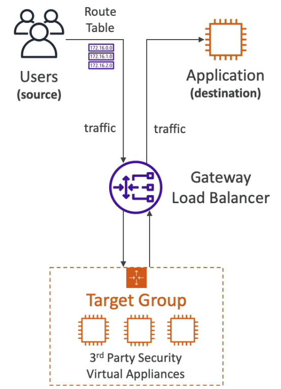
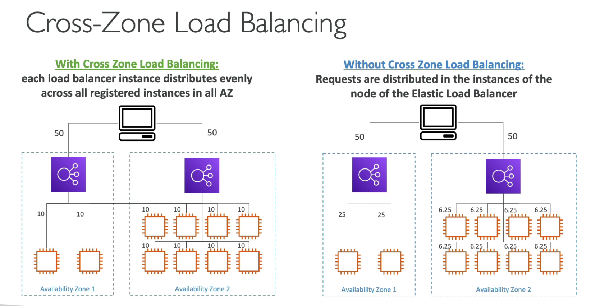

# ELB & ASG

1. Scalability & High Availability

   - Scalability means that an application / system can handle greater loads by adapting
   - There are two kinds of scalability
     1. Vertical Scalability
     2. Horizontal Scalability (= elasticity)
   - _Scalability is linked but diffrent to high availability_

2. Vertical Scalability

## ELB

- Load Balances are servers that forward traffic to multiple servers(e.g, EC2 Instances) downstream

1. Why use a lb?

   - spread load across multiple downstream instances
   - Expose a single point of access (DNS) to your application
   - Seamlessly handle failures of downstream instances
   - Do regular health checks to your instances
   - Provide SSL termination (HTTPS) for your websites
   - High availability across zones
   - Separate public traffic from private traffic

2. Healthy Checks

   - The health check is done on a port and a route

3. Types of load balancer on AWS

- type of load balancer
  1. Classic Load Balancer (2009, aka CLB): HTTP, HTTPS, TCP, SSL
  2. Application Load Balancer (2016, aka ALB): HTTP, HTTPS, Websocket
  3. Network Load Balancer (2017, NLB): TCP, TLS, UDP
  4. Gateway Load Balancer (2020, GWLB): operates at layer 3 (network protocol) - IP Protocol
- Some load balancers can be setup as private or public ELBs

4. Tips
   - Not allow instance access directly, block instance security group, setup security group to elb

###

1. Application Load balancer

   - layer 7 http only
   - load balancing to multiple http applications across machines(target groups)
   - lb to multiple app on the same machine (containers)
   - Support for http/2 and websocket
   - Support redirects (from http to https as a example)
   - Routing tables to diffrent target groups:
   - Routing based on path in URL
   - ALB are a great fit for micro services & container-based app (docker & ecs)
   - Has a port mapping feature to redirect to a dynamic port in ECS
   - CLB vs ELB
     - CLB need per app
     - ELB need only one
       

2. Target Groups

   - EC2 instances (can be managed by Auto Scaling Group) - http
   - ECS tasks
   - Lambda functions
   - IP addresses - must be private IPs
   - ALB can route to multiple target groups
   - Health checks are at the target group level

3. Network Load Balancer

   - NLB hass more lower latency then ALB (100ms vs 400ms)
   - 외부의 가용 영역 당 1개의 고정 IP를 노출
   - 특정 IP를 화이트리스트에 추가할 때 유용
   - Elastic IP 할당 지원: 엔트리포잍트를 2개를 얻고자 할 때 NLB 사용하면 해결. ALB, CLB 와의 차이점
   - NLB are used for extreme performance, TCP or UDP traffic

4. NLB target groups

- EC2 instaces
- IP Addresses - must be private IPs
- ALB: 이런경우 NLB 와 ELB 를 연결하면 고정IP를 가질수 있음

5. Gateway Load Balancer

- 가장 최신 로드밸런서
- 네트워크 트래픽을 분석하는 것 등의 역할도 수행
- 배포 및 확장과 AWS의 타사 네트워크 가상 어플라이언스의 플릿 관리에 사용
- Example: Firewalls, intrusion Detection, Prevention Systems, Deep Packet Inspection Systems, payload manipulation
- GLB 가 생성되면 모든 Routing Table 이 업데이트 된다.
- 모든 트래픽이 GWLB 를 통과 한다.
- 이 과정에서 방화벽을 예로 들면(firewalls) Traffic 을 검사하고 드랍시킬지 허용할지 결정할수 있다.
  

- Operates at Layer 3 (Network Layer) - IP Packets
- Combines the following functions:
  1.  Transparent Network Gateway - signle entry/exit for all traffic
  2.  Load Balancer - distributes traffic to your virtual appliances
- Uses the GENEVE protocol on port 6081

6.  Sticky Sessions

- Application Cookie 와 LoadBalancer Cookie가 있는데, Target Group의 attributes 에서 수정 가능하고, 설정한다면 요청에 대한 인스턴스를 고정할수 있다

7. Cross-Zone Load Balancing

- 교차 영역 로드밸런싱: 가용영역단위로 로드밸런싱이 가능하다
  

      1. 교차영역 로드밸런싱은 ALB 에 default 활성화 되어있다. cant'be disabled, No charges for inter AZ data
      2. NLB의 경우에는 default 비활성화다. 따라서 pay charges for inter AZ data if enabled
      3. CLB 는 defulat 비활성화, no charges for inter AZ data
