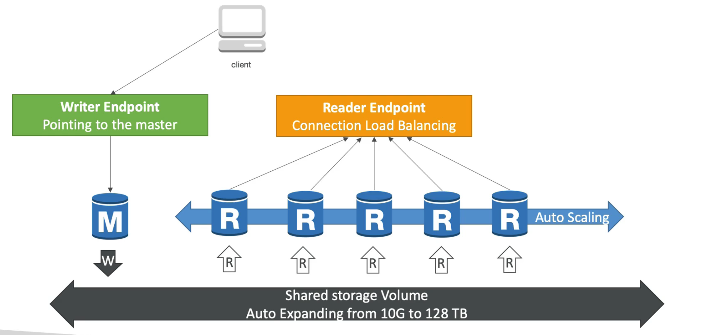

# RDS Overviw

## RDS Security Summary

1. Encryption at rest:

   - is done only when you first create the db instance
   - or unencrypted DB => snapshot => copy snapshot as encrypted => create db from snapshot(replacement)

2. Your responsibility:

   - Check the ports / IP / security group inbound rules in DB's SG
   - in-db user creation and permissions or manage through IAM
   - Creating a db with or without public access
   - Ensure parameter groups or DB is configured to only allow SSL connections

3. AWS responsibility
   - No SSH access
   - No manual DB patching
   - No manual DB OS patching
   - No way to audit the underlying instance

## Amazon Aurora (시험출제)

1.  Aurora is from AWS
2.  aurora is aws cloud optimized, claim 5x performance improvement over MySQL on RDS, over 3x performance improvement Postgres on RDS
3.  aurora strorage automatically grows in increments of 10GB, up to 128TB
4.  have 15 replicas while MySQL has 5, and replication process is faster
5.  Failover in aurora is instantaneous, it's HA native
6.  costs more then RDS (20% more)

### DB Cluster

1.  오로라 DB Scaling 을 통해 Read DB가 많이 늘어난 경우, Client 는 해당 DB의 복제본의 위치와 URL을 추적 및 연결하기는 어려운데, 이럴경우 READER Endpoint 가 있다.
    
